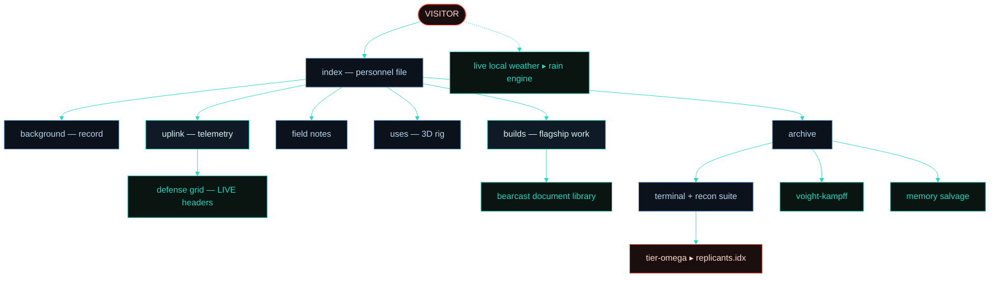

<div align="center">

```
 ██████╗ ██████╗     ██╗   ██╗     ███╗   ██╗██╗  ██╗      ██╗██████╗ ██████╗ ██╗  ██╗
██╔════╝██╔════╝     ██║   ██║     ████╗  ██║╚██╗██╔╝     ███║╚════██╗╚════██╗██║  ██║
██║     ██║  ███╗    ██║   ██║     ██╔██╗ ██║ ╚███╔╝█████╗╚██║ █████╔╝ █████╔╝███████║
██║     ██║   ██║    ╚██╗ ██╔╝     ██║╚██╗██║ ██╔██╗╚════╝ ██║ ╚═══██╗██╔═══╝ ╚════██║
╚██████╗╚██████╔╝     ╚████╔╝      ██║ ╚████║██╔╝ ██╗      ██║██████╔╝███████╗     ██║
 ╚═════╝ ╚═════╝       ╚═══╝       ╚═╝  ╚═══╝╚═╝  ╚═╝      ╚═╝╚═════╝ ╚══════╝     ╚═╝
```

### `// WALLACE CORP — NEXUS-9 PERSONNEL ARCHIVE`

🛰️ **The personal site of Cam Garrison — operator `NX-1324`.**
A cybersecurity & network systems portfolio built as an immersive, in-universe experience —
and hardened like one of the systems it writes about.

[](https://camgarrison.com)


</div>

---

> 🧬 *"More human than human" is not a slogan. It is a **specification**.*
> *And specifications, in this profession, are the difference between a system and a wish.*

---

## 📡 TRANSMISSION

This is a portfolio with a costume on. Every page is themed end-to-end around the world of
*Blade Runner 2049* — and the theming is itself the point. The brief I set for myself was the
same one I want to chase professionally: **hide the technology so completely that what's left
is a feeling.** Atmosphere first, information second, a consistent fiction holding it all together.

The second brief arrived later, and it's the one that makes this repo different from most
themed portfolios: **the security posture had to be real.** A cybersecurity portfolio that
ships with no CSP is a costume with the zipper showing. So the in-universe "defense grid"
on the uplink console isn't lore — it reads this site's *actual* response headers back from
the edge, live, and renders the result.

🔒 No frameworks. No build step. No trackers. No third-party JavaScript — not even a CDN —
and the fonts are self-hosted too. Hand-built vanilla `HTML / CSS / JS`, served static on
Cloudflare Pages behind a locked-down header policy. The only external calls the CSP permits
are the two APIs that power the live-weather atmosphere (and an optional, currently disabled
Cloudflare Web Analytics beacon).

---

## 🌃 IMMERSION FIRST

Most portfolios present **information**.

This project presents a **world.**

The goal was never to bolt a theme onto a website. The goal was to build a *believable system* — something that feels like it already exists inside the universe of *Blade Runner 2049*, and that you happen to have been granted access to.

Every visual effect, interaction, animation, transition, terminal command, dossier, and subsystem was designed around a single question:

> ⛓️ *Would this make the world feel more real?*

Only once the atmosphere is convincing does the site start delivering the actual signal underneath it — projects, skills, experience, and technical work. The fiction is the interface; the substance is real.

**Immersion first. Information second. Both, on purpose.**

---

## 🛰️ SUBSYSTEMS ONLINE

| | Subsystem | Description |
| :--: | :-- | :-- |
| 🌧️ | **Atmospheric engine** | Layered canvas rain + dust, scanlines, grain, vignette, and animated haze — with pointer/tilt **parallax depth** and a scroll-depth shade that darkens as you descend |
| ⛈️ | **Live sector weather** | The site checks the *actual* weather at the visitor's location (IP-located, no permission prompt) — when it's raining where you are, it rains in the archive, in every theme. `wx` in the terminal reads the feed |
| 🔊 | **Ambient audio** | Opt-in, fully procedural Web Audio — band-filtered noise rain, a wind swell, a low machine hum, and tiny UI ticks. Zero audio files; the rain bed swells when it's visually raining |
| 🖱️ | **Custom cursor** | SVG arrowhead with a particle trail; the native cursor is fully suppressed (and yields to the 3D rig + embedded docs) |
| 🎨 | **Three themes** | `dark` → `light` → `rain`, persisted to `localStorage` and applied *before first paint* (no flash) |
| 🌐 | **Operations Uplink** | A live console: a **dotted cyberpunk Earth** with real continents, glowing coastlines, atmosphere + a scanning meridian — plus spectrum analyzer, synthetic syslog, and ICMP ping log |
| 🛡️ | **Defense grid** | The one console panel that is **not** synthetic — it `HEAD`-requests its own origin and renders the real security headers it gets back, shield by shield |
| 🖥️ | **3D workstation** | Real-time WebGL (Three.js, self-hosted) tower modelled on my actual white build — orbit, zoom, and hover any part to light up its spec |
| ⌨️ | **Virtual terminal** | Interactive read-only shell with a fake filesystem, history, tab-complete — plus a recon suite: `nmap`, `traceroute`, `netstat`, a live `headers` interrogation, and a `decrypt` cipher puzzle hiding a lore fragment |
| 🗝️ | **Clearance system** | Everyone enters at TIER-9. TIER-OMEGA exists. There are two ways up — one is an override passphrase the baseline test keeps circling, the other is a code older than this archive |
| 🧬 | **Voight-Kampff** | A multiple-choice interrogation that tracks a synthetic "baseline" |
| 🧩 | **Memory reconstruction** | A node-graph salvage puzzle that unredacts operator memories as you solve it |
| 🪪 | **Builds dossier** | Modal-driven case studies of shipped work, rendered from a single data array — with an embedded PDF document library |
| 🔤 | **Decode headings** | Section titles scramble from archive glyphs into legible text as they scroll into view |
| 🌙 | **Idle veil** | Walk away for 90 seconds and the archive notices — the page dims behind a `SIGNAL IDLE` readout until you return |

---

## 🛡️ DEFENSE GRID — THE REAL ONE

The site practices what the field notes preach. Highlights of the shipped posture
(full policy in [`_headers`](./_headers)):

| Shield | Posture |
| :-- | :-- |
| **Content-Security-Policy** | `default-src 'none'` baseline; scripts limited to `'self'` plus a SHA-256 hash of the single inline theme-bootstrap script — no `'unsafe-inline'` in `script-src`, anywhere |
| **Third-party JS** | **Zero.** Three.js is vendored at `js/three.min.js` and the fonts are self-hosted in `/fonts`, so no external origin can serve script or style to this site. `connect-src` names exactly two data APIs (IP locate + weather) |
| **HSTS** | `max-age=31536000; includeSubDomains; preload` |
| **Framing** | `frame-ancestors 'self'` + `X-Frame-Options: SAMEORIGIN` (the site frames only its own PDFs) |
| **MIME / referrer / permissions** | `nosniff`, `strict-origin-when-cross-origin`, and a Permissions-Policy that denies camera, mic, geolocation, payment, and friends (motion sensors are `(self)` — they drive the mobile tilt parallax) |
| **Isolation** | `Cross-Origin-Opener-Policy: same-origin`, `Cross-Origin-Resource-Policy: same-origin` |
| **Disclosure** | RFC 9116 [`/.well-known/security.txt`](./.well-known/security.txt) — found something? say something |
| **Input handling** | The terminal escapes every byte of user input before it touches the DOM; the virtual filesystem is read-only by design |

> 🔭 Verify it yourself: open the **Uplink** page and read the defense grid panel,
> or open the **Archive** terminal and run `headers`. Both pull live values from the
> response you are currently holding — not a hardcoded list.

---

## 🗺️ SECTOR MAP



```text
index.html       🪪  Personnel file — hero, identity, recent deployments
background.html  🎓  Full academic + internship record
builds.html      🛠️  Flagship builds — Bearcast Media, NetSweep, this archive
blog.html        📝  Field Notes — technical writeups & lab stories
uses.html        🖥️  Loadout — interactive 3D workstation model (self-hosted Three.js)
uplink.html      🛰️  Operations console — synthetic telemetry + one very real panel
archive.html     🗂️  Off-record — terminal, recon suite, V-K, memory puzzle
404.html         💀  "Memory not found" — glitched fallback
```

---

## 🪪 FLAGSHIP BUILDS

> Real, deployed work — not mockups. Each is a live system I designed and built end to end.

- 📻 **Bearcast Media** · [`bearcastmedia.com`](https://bearcastmedia.com) — the full public platform for UC's student media organization: nine interconnected pages, a live radio stream, a headless **Sanity** CMS, and a security posture I took from an **F to an A**. The dossier ships an embedded **document library**: a cyber white paper, a technical white paper, and a system-architecture diagram.
- 🔭 **NetSweep** · [`netsweepapp.com`](https://netsweepapp.com) — a free, on-device iOS network-security scanner with a spatial "observatory" canvas UI. Built in **SwiftUI**, fully on-device, no data leaves the phone.
- 🌐 **This Archive** · [`camgarrison.com`](https://camgarrison.com) — the experience you're reading the source of. The most over-engineered resume I'll ever write, and the proof-of-craft for everything above.

---

## ⌨️ FIELD MANUAL — THE TERMINAL

The archive's shell rewards the curious. A non-exhaustive tour:

```text
help                 the honest list
nmap wallace.corp    service-scan a registry host (simulated; the real attack
                     surface of this site is port 443 and a static file server)
traceroute           eight hops, one of which does not want to be found
headers              interrogate the LIVE security headers of the page you're on
wx                   the weather where YOU are — and whether the archive is raining
cat defense.cfg      the posture, written down
ls                   there is a file with a .enc extension. you know what to do.
decrypt ghost.enc    cipher recovery — recovers something worth reading
clearance            TIER-9. for now.
override <code>      the word the baseline test keeps coming back to.
incept               the date you first made contact (stored only on your machine)
goto builds          the terminal is also a nav system
```

Somewhere above the terminal, a ten-key sequence from an older archive also still works.

---

## 🧰 TECH STACK

- 🧱 **Markup / style** — semantic HTML5, hand-authored CSS (custom properties, `color-mix`, grid, layered canvas effects)
- ⚡ **Behavior** — vanilla ES6+, zero dependencies, one `main.js`
- 🧊 **3D** — [Three.js](https://threejs.org/) r128, **vendored** at `js/three.min.js` (only loaded on `uses.html`); custom orbit/zoom, no OrbitControls, no CDN
- 🔤 **Type** — Major Mono Display *(display)*, JetBrains Mono *(mono)*, Syne *(sans)* — **self-hosted** variable `woff2` in `/fonts`, preloaded, no Google Fonts at runtime
- 🔊 **Sound** — procedural Web Audio (noise-synth rain, wind, hum, UI ticks); no audio files, context created only after opt-in
- ⛈️ **Weather** — `ipwho.is` (IP → city, no prompt) + `open-meteo.com` (conditions), cached 30 min, drives the rain canvas
- ☁️ **Hosting** — Cloudflare Pages with a [`_headers`](./_headers) policy, configured with [`wrangler`](https://developers.cloudflare.com/workers/wrangler/)
- ♿ **Quality floor** — `prefers-reduced-motion` quiets the atmosphere, parallax, and decode effects; skip-to-content link; the dossier modal traps and restores keyboard focus; theme applied before first paint

---

## 🎨 DESIGN SYSTEM

A deliberately **cold** palette — no orange, no amber. Red is reserved for warnings only (the V-K's tell — and now, the TIER-OMEGA grant).

| Swatch | Token | Role | Value |
| :--: | :-- | :-- | :-- |
|  | `--accent` | primary — steel glow | `#6ba3d8` |
|  | `--accent-2` | secondary — teal | `#2dd4bf` |
|  | `--accent-3` | highlight — ice / "Joi white" | `#b8d6ed` |
|  | `--accent-4` | **V-K warning only** — crimson | `#ff4d36` |
|  | `--bg` | the void | `#050608` |

> 🌧️ Each of the three themes re-binds these tokens — including a dedicated set of globe variables — so every subsystem, down to the rotating Earth, recolors itself with no reload.

---

## ⚙️ RUN IT LOCAL

It's a static site — any server works:

```bash
# clone
git clone https://github.com/notChewy1324/cgSite.git
cd cgSite

# serve (pick one)
python3 -m http.server 8080
#   or
npx serve .
```

Then open `http://localhost:8080` 🌐

> Note: the defense grid will honestly report `EXPOSED` for most shields on a local
> server — `_headers` only applies at the Cloudflare edge. That's the point of it
> being real.

---

## 🚀 DEPLOY

Configured for Cloudflare Pages via `wrangler.jsonc`:

```bash
npm install -g wrangler
wrangler pages deploy .
```

> ⚠️ If you ever edit the inline theme-bootstrap `<script>` in the HTML heads, the CSP
> hash in `_headers` must be recomputed — the command to do it is written in a comment
> at the top of that file. All eight pages share one identical inline script on purpose.

---

## 🗂️ PROJECT STRUCTURE

```
cgSite/
├── index.html              # 🪪 home / personnel file
├── background.html         # 🎓 academic + experience record
├── builds.html             # 🛠️ flagship project dossiers
├── blog.html               # 📝 field notes
├── uses.html               # 🖥️ 3D workstation loadout
├── uplink.html             # 🛰️ operations console + live defense grid
├── archive.html            # 🗂️ terminal + V-K + memory puzzle
├── 404.html                # 💀 fallback
├── style.css               # 🎨 all styling, themes, components
├── main.js                 # ⚡ all behavior + content data (BLOG_POSTS, PROJECTS, etc.)
├── _headers                # 🛡️ Cloudflare Pages security header policy (CSP, HSTS, ...)
├── robots.txt              # 🤖 crawlers welcome, replicants tolerated
├── sitemap.xml             # 🗺️ for the indexers
├── .well-known/
│   └── security.txt        # 📨 RFC 9116 disclosure channel
├── js/
│   └── three.min.js        # 🧊 vendored Three.js r128 (no CDN)
├── fonts/                  # 🔤 self-hosted variable woff2 (no Google Fonts at runtime)
├── wrangler.jsonc          # ☁️ Cloudflare Pages config
├── docs/                   # 📜 embedded PDFs (white papers + diagram)
└── imgs/                   # 🖼️ favicons, touch icons, og-card social image
```

> 📝 **Editing content:** posts live in `window.BLOG_POSTS` and builds live in `window.PROJECTS`
> at the top of `main.js`. Add an object — it renders itself, card *and* modal included.
>
> 📜 **Build documents:** the Bearcast dossier embeds PDFs from a `docs/` folder next to
> `index.html` (committed to the repo; Cloudflare Pages serves them as static files).
> Expected files: `docs/bearcast-cyber-whitepaper.pdf`, `docs/bearcast-technical-whitepaper.pdf`,
> `docs/bearcast-architecture-diagram.pdf`. Keep each under ~25 MB (Cloudflare Pages per-file limit).

---

## 🔌 ESTABLISH UPLINK

- 🌐 **Site** — [camgarrison.com](https://camgarrison.com)
- 📨 **Disclosure** — [/.well-known/security.txt](https://camgarrison.com/.well-known/security.txt)

<div align="center">

---

`© 2026 CAM GARRISON ◊ ARCHIVE NX-1324 ◊ THIS RECORD WILL NOT REMEMBER YOU`

⛓️ *Cells interlinked within cells interlinked.* ⛓️

</div>
