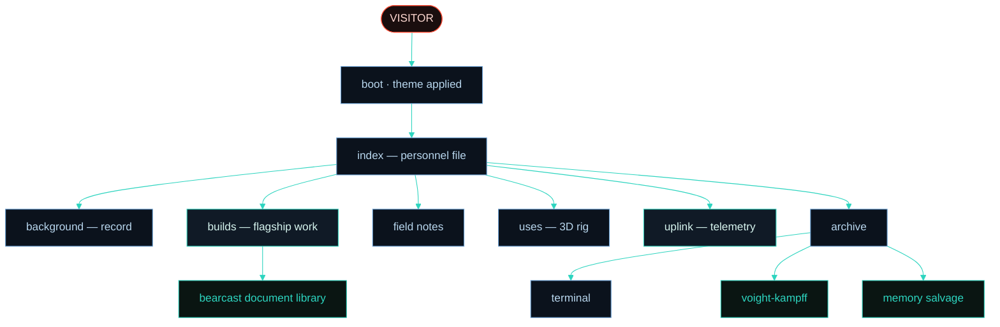

<div align="center">

```
 ██████╗ ██████╗     ██╗   ██╗     ███╗   ██╗██╗  ██╗      ██╗██████╗ ██████╗ ██╗  ██╗
██╔════╝██╔════╝     ██║   ██║     ████╗  ██║╚██╗██╔╝     ███║╚════██╗╚════██╗██║  ██║
██║     ██║  ███╗    ██║   ██║     ██╔██╗ ██║ ╚███╔╝█████╗╚██║ █████╔╝ █████╔╝███████║
██║     ██║   ██║    ╚██╗ ██╔╝     ██║╚██╗██║ ██╔██╗╚════╝ ██║ ╚═══██╗██╔═══╝ ╚════██║
╚██████╗╚██████╔╝     ╚████╔╝      ██║ ╚████║██╔╝ ██╗      ██║██████╔╝███████╗     ██║
 ╚═════╝ ╚═════╝       ╚═══╝       ╚═╝  ╚═══╝╚═╝  ╚═╝      ╚═╝╚═════╝ ╚══════╝     ╚═╝
```

### `// WALLACE CORP — NEXUS-9 PERSONNEL ARCHIVE`

🛰️ **The personal site of Cam Garrison — operator `NX-1324`.**
A cybersecurity & network systems portfolio built as an immersive, in-universe experience.

[](https://camgarrison.com)


</div>

---

> 🧬 *"More human than human" is not a slogan. It is a **specification**.*
> *And specifications, in this profession, are the difference between a system and a wish.*

---

## 📡 TRANSMISSION

This is a portfolio with a costume on. Every page is themed end-to-end around the world of
*Blade Runner 2049* — and the theming is itself the point. The brief I set for myself was the
same one I want to chase professionally: **hide the technology so completely that what's left
is a feeling.** Atmosphere first, information second, a consistent fiction holding it all together.

🔒 No frameworks. No build step. No trackers. Hand-built vanilla `HTML / CSS / JS`, served static on Cloudflare Pages.

---

## 🌃 IMMERSION FIRST

Most portfolios present **information**.

This project presents a **world.**

The goal was never to bolt a theme onto a website. The goal was to build a *believable system* — something that feels like it already exists inside the universe of *Blade Runner 2049*, and that you happen to have been granted access to.

Every visual effect, interaction, animation, transition, terminal command, dossier, and subsystem was designed around a single question:

> ⛓️ *Would this make the world feel more real?*

Only once the atmosphere is convincing does the site start delivering the actual signal underneath it — projects, skills, experience, and technical work. The fiction is the interface; the substance is real.

**Immersion first. Information second. Both, on purpose.**

---

## 🛰️ SUBSYSTEMS ONLINE

| | Subsystem | Description |
| :--: | :-- | :-- |
| 🌧️ | **Atmospheric engine** | Layered canvas rain + dust, scanlines, grain, vignette, and animated haze |
| 🖱️ | **Custom cursor** | SVG arrowhead with a particle trail; the native cursor is fully suppressed (and yields to the 3D rig + embedded docs) |
| 🎨 | **Three themes** | `dark` → `light` → `rain`, persisted to `localStorage` and applied *before first paint* (no flash) |
| 🌐 | **Operations Uplink** | A live console: a **dotted cyberpunk Earth** with real continents, glowing coastlines, atmosphere + a scanning meridian — plus spectrum analyzer, synthetic syslog, and ICMP ping log |
| 🖥️ | **3D workstation** | Real-time WebGL (Three.js) tower modelled on my actual white build — orbit, zoom, and hover any part to light up its spec |
| ⌨️ | **Virtual terminal** | Interactive read-only shell with a fake filesystem, command history, and tab-complete |
| 🧬 | **Voight-Kampff** | A multiple-choice interrogation that tracks a synthetic "baseline" |
| 🧩 | **Memory reconstruction** | A node-graph salvage puzzle that unredacts operator memories as you solve it |
| 🪪 | **Builds dossier** | Modal-driven case studies of shipped work, rendered from a single data array — with an embedded PDF document library |
| 🌀 | **Warp transitions** | Optional page-to-page "establishing uplink" overlay |

---

## 🗺️ SECTOR MAP



```text
index.html       🪪  Personnel file — hero, identity, recent deployments
background.html  🎓  Full academic + internship record
builds.html      🛠️  Flagship builds — Bearcast Media, NetSweep, this archive
blog.html        📝  Field Notes — technical writeups & lab stories
uses.html        🖥️  Loadout — interactive 3D workstation model
uplink.html      🛰️  Operations console — live (synthetic) telemetry
archive.html     🗂️  Off-record — terminal, V-K test, memory puzzle
404.html         💀  "Memory not found" — glitched fallback
```

---

## 🪪 FLAGSHIP BUILDS

> Real, deployed work — not mockups. Each is a live system I designed and built end to end.

- 📻 **Bearcast Media** · [`bearcastmedia.com`](https://bearcastmedia.com) — the full public platform for UC's student media organization: nine interconnected pages, a live radio stream, a headless **Sanity** CMS, and a security posture I took from an **F to an A**. The dossier ships an embedded **document library**: a cyber white paper, a technical white paper, and a system-architecture diagram.
- 🔭 **NetSweep** · [`netsweepapp.com`](https://netsweepapp.com) — a free, on-device iOS network-security scanner with a spatial "observatory" canvas UI. Built in **SwiftUI**, fully on-device, no data leaves the phone.
- 🌐 **This Archive** · [`camgarrison.com`](https://camgarrison.com) — the experience you're reading the source of. The most over-engineered resume I'll ever write, and the proof-of-craft for everything above.

---

## 🧰 TECH STACK

- 🧱 **Markup / style** — semantic HTML5, hand-authored CSS (custom properties, `color-mix`, grid, layered canvas effects)
- ⚡ **Behavior** — vanilla ES6+, zero dependencies, one `main.js`
- 🧊 **3D** — [Three.js](https://threejs.org/) r128 (CDN, only on `uses.html`); custom orbit/zoom, **no OrbitControls dependency**
- 🔤 **Type** — Major Mono Display *(display)*, JetBrains Mono *(mono)*, Syne *(sans)*, via Google Fonts
- ☁️ **Hosting** — Cloudflare Pages, configured with [`wrangler`](https://developers.cloudflare.com/workers/wrangler/)

---

## 🎨 DESIGN SYSTEM

A deliberately **cold** palette — no orange, no amber. Red is reserved for warnings only (the V-K's tell).

| Swatch | Token | Role | Value |
| :--: | :-- | :-- | :-- |
|  | `--accent` | primary — steel glow | `#6ba3d8` |
|  | `--accent-2` | secondary — teal | `#2dd4bf` |
|  | `--accent-3` | highlight — ice / "Joi white" | `#b8d6ed` |
|  | `--accent-4` | **V-K warning only** — crimson | `#ff4d36` |
|  | `--bg` | the void | `#050608` |

> 🌧️ Each of the three themes re-binds these tokens — including a dedicated set of globe variables — so every subsystem, down to the rotating Earth, recolors itself with no reload.

---

## ⚙️ RUN IT LOCAL

It's a static site — any server works:

```bash
# clone
git clone https://github.com/notChewy1324/cgSite.git
cd cgSite

# serve (pick one)
python3 -m http.server 8080
#   or
npx serve .
```

Then open `http://localhost:8080` 🌐

---

## 🚀 DEPLOY

Configured for Cloudflare Pages via `wrangler.jsonc`:

```bash
npm install -g wrangler
wrangler pages deploy .
```

---

## 🗂️ PROJECT STRUCTURE

```
cgSite/
├── index.html          # 🪪 home / personnel file
├── background.html     # 🎓 academic + experience record
├── builds.html         # 🛠️ flagship project dossiers
├── blog.html           # 📝 field notes
├── uses.html           # 🖥️ 3D workstation loadout
├── uplink.html         # 🛰️ operations console
├── archive.html        # 🗂️ terminal + V-K + memory puzzle
├── 404.html            # 💀 fallback
├── style.css           # 🎨 all styling, themes, components
├── main.js             # ⚡ all behavior + content data (BLOG_POSTS, PROJECTS, etc.)
├── wrangler.jsonc      # ☁️ Cloudflare Pages config
├── docs/               # 📜 embedded PDFs (white papers + diagram)
└── imgs/               # 🖼️ favicons + touch icons
```

> 📝 **Editing content:** posts live in `window.BLOG_POSTS` and builds live in `window.PROJECTS`
> at the top of `main.js`. Add an object — it renders itself, card *and* modal included.
>
> 📜 **Build documents:** the Bearcast dossier embeds PDFs from a `docs/` folder next to
> `index.html` (committed to the repo; Cloudflare Pages serves them as static files).
> Expected files: `docs/bearcast-cyber-whitepaper.pdf`, `docs/bearcast-technical-whitepaper.pdf`,
> `docs/bearcast-architecture-diagram.pdf`. Keep each under ~25 MB (Cloudflare Pages per-file limit).

---

## 🔌 ESTABLISH UPLINK

- 🌐 **Site** — [camgarrison.com](https://camgarrison.com)

<div align="center">

---

`© 2026 CAM GARRISON ◊ ARCHIVE NX-1324 ◊ THIS RECORD WILL NOT REMEMBER YOU`

⛓️ *Cells interlinked within cells interlinked.* ⛓️

</div>